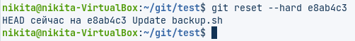

## Работа с удаленными репозиториями и GitHub

### Цель работы

Освоить основные навыки работы с облачными и распределенными системами контроля версий, получить навыки работы с инструментальными средствами, обеспечивающими командную работу над разработкой ПО.

### Задания для выполнения

1. Зарегистрироваться на сайте github.com
2. Установить на компьютере программу Git
3. Форкнуть данный репозиторий в свой аккаунт
4. Склонировать созданный удаленный репозиторий в директорию ~/git/test

6. На локальной машине пишем скрипт ~/git/test/backup.sh, с произвольным содержанием

8. Фиксируем скрипт в репозитории (делаем коммит)

10. Обновляем удаленный репозиторий репозиторий (делаем пуш)

12. Через текстовый редактор добавить любую новую строку с комментарием

14. Сделать коммит

16. Вности синтаксическую ошибку в скрипт

18. Сделать коммит ошибочного скрипта

20. Откатываем до последней рабочей версии

22. Просмотреть историю коммитов

24. Добавить несколько коммитов произвольного содержимого

26. Создать пулл реквест в данный репозиторий

### Контрольные вопросы

1. Зачем нужен облачный хостинг репозиториев?
Облачный хостинг репозиториев нужен для того, чтобы несколько человек могли удобно работать в общем репозитории.
2. Какими основными функциями обладает сайт github.com?
Помимо основоного функционала git, сайт github.com позволяет делать форки (копирование чужодого репозитория к себе), пулл реквесты (запрос на внесение измененеий в чужой репозиторий из своей модифицированныной копии), при нахождении багов можно открыть тему с проблемой (issues), разграничить права досутпа и многое другое.
3. Как организовать командную работу над открытым проектом?

### Дополнительные задания

1. Дополнительно оценивается, если студент продемонстрирует работу с ветками в процессе написания более-сложного программного проекта (не менее трех файлов, двух веток, десяти коммитов, как минимум одно объединение).
2. Дополнительно оценивается демонстрация командной работы. Для этого нужно склонировать репозиторий другому члену команды и коммитить от своего имени. При отправке истории на удаленный сервер (push) на сайте будет отображаться общая история. При скачивании истории с сервера (pull) общая история будет отображаться на локальном компьютере.
3. Настройте работу с git вашей интегрированной среды разработки по выбору. Для работы с python рекомендуется использовать PyCharm. Выполните задания лабораторной работы в IDE используя встроенные средства работы с системами контроля версий.
